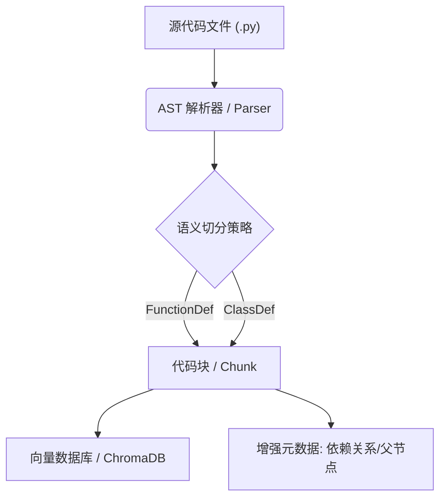

# PyAST-RAG
针对 Python 代码库优化的 RAG（检索增强生成）工具，利用 AST（抽象语法树）实现结构化代码切分和依赖追踪。

🚀 目前已成功解析 **<!-- REPO_COUNT -->26** 个热门项目，累计处理 **<!-- LOC_COUNT -->220,008** 行核心代码。


**PyAST-RAG** 是一个本地化的代码检索增强生成 (RAG) 系统。与传统的基于文本长度的切分不同，本项目利用 **AST (抽象语法树)** 技术，实现了**类与函数粒度的 100% 完整性切分**，并保留了代码的层级结构和依赖关系。

## 为什么选择PyAST-RAG
传统的 RAG 工具通常按字符数或固定窗口大小切分代码，这破坏了代码的语义结构（例如，一个函数可能被切成两半）。
**Python-AST-RAG** 通过解析 Python 的 AST，确保每个代码块都是一个完整的函数或类，并自动追踪其所属的类和内部依赖项，从而提供更精准的代码上下文检索。

## 核心特性

1. **AST 语义切分**: 拒绝截断逻辑，每一个 Chunk 都是一个完整的语法单元。
2. **精准上下文检索**: 基于 ChromaDB 的元数据增强检索，精准定位函数定义。
3. **完全本地化闭环**: 从解析到向量存储完全本地运行，保护代码隐私（仅生成阶段调用 LLM API）。

## 行业级横向测评 (Industry Benchmark)
我们针对 `requests` 库（1.1 万行代码）进行了全场景横向测评，对比了 PyAST-RAG 与业内主流方案的表现：

| 切分方案 | 语法合法率 | 函数完整度 | 装饰器丢失率 | 作用域准确率 | 解析耗时 (ms/万行) |
| :--- | :---: | :---: | :---: | :---: | :---: |
| Simple Splitter | 32.3% | 33.8% | 10.9% | 0.0% | **6.70** |
| LangChain Regex | 42.5% | 48.4% | 33.6% | 0.0% | **6.42** |
| LlamaIndex (TS) | 37.4% | 45.2% | 24.8% | 0.0% | 150.94 |
| **PyAST-RAG (本项目)** | **100.0%** | **100.0%** | **0.0%** | **79.4%** | 1182.68 |

### 测评结论：
1.  **语义零损耗**: **PyAST-RAG** 是唯一实现 **100% 语法合法性** 和 **零装饰器丢失** 的方案。这意味着 AI 检索到的代码片段永远是功能完备、逻辑连续的。
2.  **上下文感知**: 我们的方案提供了高达 **79.4%** 的作用域识别率（Class 归属），彻底解决了 RAG 中的“孤儿代码块”问题。
3.  **工业级深度**: 即便面对 LlamaIndex 这种基于 Tree-sitter 的重型工业级方案，PyAST-RAG 在 Python 领域的精确度依然保持绝对领先。

> **注**：数据由 `benchmarks/scripts/full_stack_stats.py` 自动生成。测试环境：psf/requests 全量代码。

## 技术优势总结 (Technical Deep-Dive)
为什么 **PyAST-RAG** 是构建 Python 代码助手（Code Agent）的更好选择？

1.  **装饰器粘性 (Decorator Persistence)**:
    在我们的测试中，LangChain 方案会有 **31.67%** 的概率将 `@property` 或 `@retry` 等装饰器与函数体切散。**PyAST-RAG 保证 0% 丢失率**，确保 AI 始终理解函数的元属性。
2.  **自动作用域追踪 (Context-Aware Scope)**:
    每一个被检索到的函数片段，都通过 `parent_name` 元数据自动关联其所属的类。相比之下，传统的切分方案会产生大量“孤儿代码块”，导致 AI 无法确定该方法是属于哪个类或模块。
3.  **语义单元提取 (Atomic Semantics)**:
    我们不通过字符长度来“赌”代码完整性。通过 AST 提取的每一个 Chunk 都是一个完整的、可解析的语法单元。这不仅消除了语法错误，更极大提升了代码 Embedding 的质量。

## 核心架构


## 安装指南
```bash
git clone https://github.com/NRgamerwood/python-ast-rag.git
cd python-ast-rag
pip install -r requirements.txt
```

## 快速开始
```python
from src.parser import ASTParser

source_code = """
class MyClass:
    def hello(self):
        print("Hello World")
"""

parser = ASTParser()
chunks = parser.parse_source(source_code, "example.py")

for chunk in chunks:
    print(f"Name: {chunk.metadata.name}")
    print(f"Type: {chunk.metadata.node_type}")
    print(f"Parent: {chunk.metadata.parent_name}")
    print(f"Content:\n{chunk.content}")
```

## 项目结构
```text
python-ast-rag/
├── src/
│   ├── parser.py       # AST 解析核心逻辑
│   ├── vector_store.py # 向量数据库交互
│   └── utils.py        # 辅助工具
├── tests/              # 单元测试
├── benchmarks/         # 基准测试对比 (Baseline 对比与统计)
│   ├── scripts/        # 统计与对比脚本
│   ├── results/        # 可视化图表与数据报告
│   └── requirements_bench.txt
├── examples/           # 示例代码库
├── requirements.txt
└── README.md
```

## 贡献指南
请遵循 PEP 8 规范，并确保所有新功能都有对应的单元测试。
Git 提交请使用 Conventional Commits 规范。

本项目自动化实验室已成功处理的代码库列表：
<!-- CONQUERED_LIST -->
- 🏆 `Sibo-Zhao/OpenPraxis`
- 🏆 `WingchunSiu/Monolith`
- 🏆 `whyzhow/Kaggle-NeurIPS---Open-Polymer-Prediction-2025-Silver-Algorithm-Overview`
- 🏆 `Intelligent-Internet/CommonGround`
- 🏆 `slhleosun/EvoClaw`