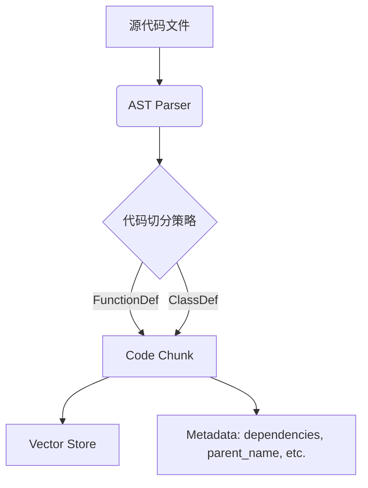

# PyAST-RAG
针对 Python 代码库优化的 RAG（检索增强生成）工具，利用 AST（抽象语法树）实现结构化代码切分和依赖追踪。


**PyAST-RAG** 是一个本地化的代码检索增强生成 (RAG) 系统。与传统的基于文本长度的切分不同，本项目利用 Python **AST (抽象语法树)** 技术，实现了**类与函数粒度的 100% 完整性切分**，并保留了代码的层级结构和依赖关系。

## 为什么选择PyAST-RAG
传统的 RAG 工具通常按字符数或固定窗口大小切分代码，这破坏了代码的语义结构（例如，一个函数可能被切成两半）。
**Python-AST-RAG** 通过解析 Python 的 AST，确保每个代码块（Chunk）都是一个完整的函数或类，并自动追踪其所属的类（parent_name）和内部依赖项，从而提供更精准的代码上下文检索。

## 核心特性

1. **AST 语义切分**: 拒绝截断逻辑，每一个 Chunk 都是一个完整的语法单元。
2. **精准上下文检索**: 基于 ChromaDB 的元数据增强检索，精准定位函数定义。
3. **完全本地化闭环**: 从解析到向量存储完全本地运行，保护代码隐私（仅生成阶段调用 LLM API）。

## 核心架构


## 安装指南
```bash
git clone https://github.com/NRgamerwood/python-ast-rag.git
cd python-ast-rag
pip install -r requirements.txt
```

## 快速开始
```python
from src.parser import ASTParser

source_code = """
class MyClass:
    def hello(self):
        print("Hello World")
"""

parser = ASTParser()
chunks = parser.parse_source(source_code, "example.py")

for chunk in chunks:
    print(f"Name: {chunk.metadata.name}")
    print(f"Type: {chunk.metadata.node_type}")
    print(f"Parent: {chunk.metadata.parent_name}")
    print(f"Content:\n{chunk.content}")
```

## 项目结构
```text
python-ast-rag/
├── src/
│   ├── parser.py       # AST 解析核心逻辑
│   ├── vector_store.py # 向量数据库交互
│   └── utils.py        # 辅助工具
├── tests/              # 单元测试
├── examples/           # 示例代码库
├── requirements.txt
└── README.md
```

## 贡献指南
请遵循 PEP 8 规范，并确保所有新功能都有对应的单元测试。
Git 提交请使用 Conventional Commits 规范。
